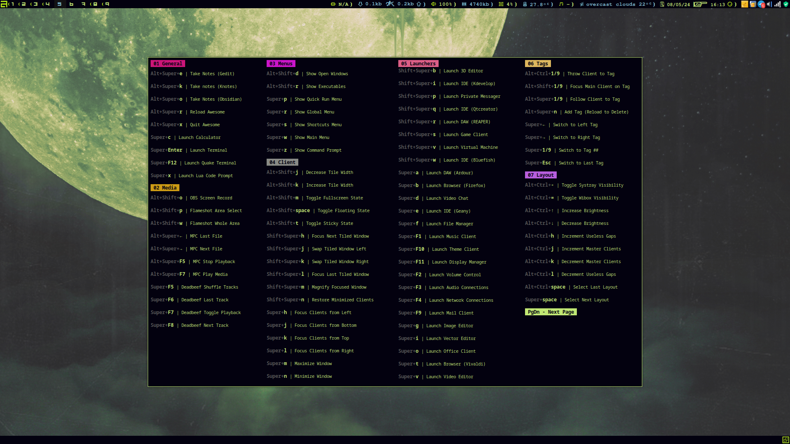

### TacOS User Config
###### General
This config aims to provide a fully functional and visually acceptable setup out of the
[(taco)](https://cdn0.woolworths.media/content/wowproductimages/large/228151.jpg) box.
The application folders included for builtin support have been carefully chosen because
preconfiguring every frontend program installed on TacOS would bloat the isos. Rest
assured the window manager wont throw any errors due to the misconfiguration of a utility
it needs to run.
Please note that the Lain and Freedekstop.org libraries are better left inside
`/usr/lib/lua/5.3` for the AwesomeWM config. It features an extensive set of launchers and
other shortcuts for client management, a nicely styled theme with a custom icon set and,
a variety of system menus and widgets. Custom configs are included for autostart
applications like Picom, and shell scripts have been integrated with the Lua code for
handling temperamental systems like Pulse.
###### Depends
- **awesome-freedesktop-git (AUR)**: Freedesktop.org desktop entries and menu for AwesomeWM
- **cadence (AUR)**: JACK toolbox for audio production
- **deadbeef**: Modular GTK audio player for GNU/Linux
- **dmenu**: Generic menu for X
- **knotes**: Popup notes
- **lain-git** (AUR): Layouts, asynchronous widgets and utilities for AwesomeWM
- **mpc**: Minimalist command line interface to MPD
- **mpd**: Flexible, powerful, server-side application for playing music
- **nm-connection-editor**: NetworkManager GUI connection editor and widgets
- **pamac-aur (AUR)**: Package Manager based on libalpm with AUR and Appstream support
- **picom**: Lightweight compositor for X11
- **pulseaudio**: Featureful, general-purpose sound server
- **rofi**: Window switcher, application launcher and dmenu replacement
- **systemd**: System and service manager
- **volumeicon**: Volume control for the system tray
- **wezterm**: GPU-accelerated cross-platform terminal emulator and multiplexer
- **xdotool**: Command-line X11 automation tool
###### Installation
The installation of dependencies and initialization of the WM in the X config is handled
automatically in TacOS. No manual intervention is immediately required. If all which is
desired from this repo is the config, feel free to save and run the shell script below,
it will need to be made executable (chmod explained in main readme):
```sh
#!/bin/bash
[ ! -e '/bin/rsync' ] &&
	echo 'Please install Rsync before running this script'; exit 0
[ ! -e '/bin/awesome' ] &&
	echo 'Please install AwesomeWM before running this script'; exit 0
cd || exit 1 &>'/dev/null'
git clone 'https://github.com/c0rnch1p/tacos.git' ||
git clone 'https://gitlab.com/c0rnch1p/tacos.git'
[ -d "$HOME/tacos/tacos/airootfs/etc/skel/.config" ] &&
	rsync -av "$HOME/tacos/tacos/airootfs/etc/skel/.config/" "$HOME/.config/"
rm -rf "$HOME/tacos" & clear
```
After the script has been run, the currently active display server on the system can be
configured to start the Awesome window manager when it loads the graphical environment.
This is done on X.org by appending the following line to `/etc/X11/xinit/xinitrc`:
```sh
exec '/usr/bin/awesome'
```
###### Openweather
To configure the weather widget, set the API key and city ID in `configs/openweather.conf`
like so:
```ini
api_key=user_api_key
city_id=user_city_id
```
Replace `user_api_key` and `user_city_id` with the OpenWeatherMap API key and the city
ID for the zone. City IDs are obtained via https://openweathermap.org/find and are visible
in each city page URL. API keys are created once an account is created at
https://home.openweathermap.org/users/sign_up.
###### Hotkeys
AwesomeWM comes with a builtin hotkey popup menu that can be accessed with `Super+s` on
the keyboard. This will display all the available shortcuts in the current config.
| |  | |
|-|-|-|
###### Programs
| |  | |
|-|-|-|
###### Terminals
| |  | |
|-|-|-|
###### Awesome Icon Set 4u (Icon res: 640x640px)
| |  | |
|-|-|-|