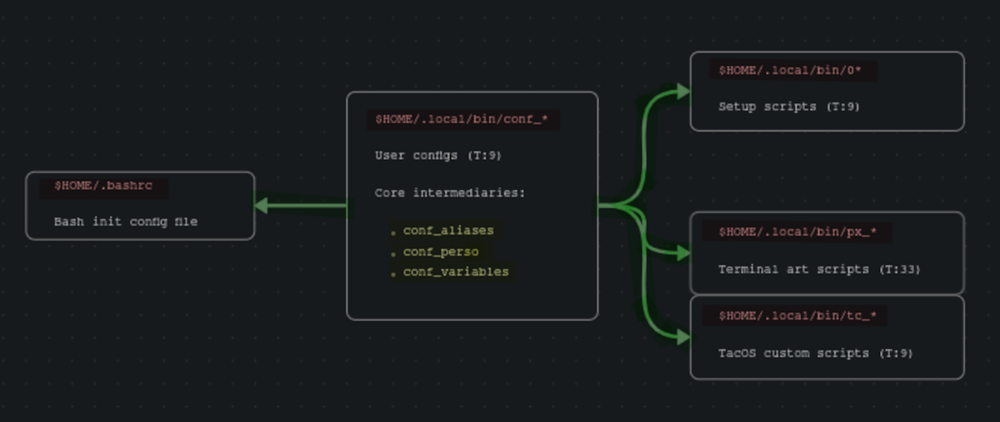

### TacOS Bash Config
###### General
Each script in this directory is part of the TacOS Bash config, they are linked through
the nine files prefixed with `conf_`, seven of them are scripts sourced by the `.bashrc`
among a few others. The conf files are the most important files here because they serve
as a means for the user to personalize the way Bash behaves across the system. There is a
conf file for each of the following purposes:
- **conf_aliases**: Defining aliases
- **conf_bupconf**: Backing up files
- **conf_bupcopy**: Backing up directories
- **conf_cleanup**: Cleaning up files and folders
- **conf_daemons**: Autostarting daemons
- **conf_insulter**: Writing insults
- **conf_perso**: Storing personal code
- **conf_speeddial**: Reading and editing frequent files
- **conf_variables**: Exporting variables
###### Naming Scheme
The `conf_perso` file doesnt require any attention from the user unless they intend to
create a fork of TacOS and keep some shell code private. The setup scripts prefixed with
a number are used after a fresh install to configure Arch Linux for the environment. Each
of them has a condition allowing for the user to call a function as an argument without
needing to run the entire script.
The files prefixed with `px_` are a nifty set of scripts courtesy of Arco Linux that add
a nice flair to the terminal. The files prefixed with `tc_` are the TacOS custom scripts,
they are essentially just a collection of wrappers that make navigation and performing
different tasks a little easier. For example things such as searching for items on the
system, extracting archives, managing encrypted files and other standard procedures.
###### Flow Chart
| |  | |
|-|-|-|
##### Intermediaries
When the shell starts a new session, input in the intermediary files is used multiple
times across the other scripts. They are sourced before the other conf files in the
`.bashrc` along with the `05_permissions` setup file. The permissions file is an optional
conf file which double checks some file attributes once per session with a temp lock
system. All the input in the conf files can safely be used globally after the shell has
been reloaded at least once during the current user session.
###### Installation
If all which is desired from this repo is the bash config, feel free to save and run the
shell script below, it will need to be made executable (chmod explained in main readme):
```sh
#!/bin/bash
[ ! -e '/bin/rsync' ] &&
	echo 'Please install Rsync before running this script'; exit 0
git clone 'https://github.com/c0rnch1p/tacos.git' ||
git clone 'https://gitlab.com/c0rnch1p/tacos.git'
[ -d "$HOME/tacos/tacos/airootfs/etc/skel/.local/bin" ] &&
	rsync -av "$HOME/tacos/tacos/airootfs/etc/skel/.local/bin/" "$HOME/.local/bin/"
rm -rf "$HOME/tacos" & clear
```
Before the script is run, please source the `conf` files the same way as they are
in the TacOS [`.bashrc`](../../.bashrc) in the one used by the current config.